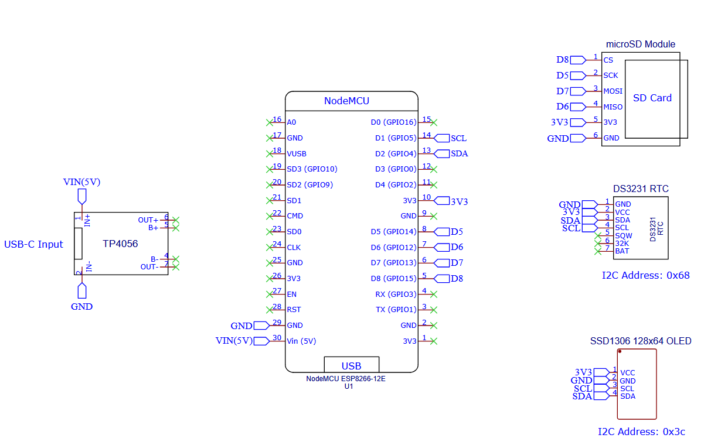

# SolarWeatherStation
A **solar-powered weather station** with an indoor head unit and a web server for displaying real-time weather data. Built using **ESP32** and **ESP8266** platforms with off-the-shelf components, featuring custom power management for self-sufficient operation.

Images here:
<!-- Optional: Hero image or animation -->
<!--  -->

# Table of Contents

1. [Overview](#overview)
2. [Features](#features)
3. [Performance](#performance)
4. [Design Showcase](#design-showcase)
5. [Bill of Materials](#bill-of-materials)
5. [System Architecture](#system-architecture)
   - [External Weather Station](#external-weather-station)
   - [Internal Head Unit](#internal-head-unit)
6. [Firmware & Code](#firmware--code)
   - [External Weather Station Code](#external-weather-station-code)
   - [Internal Head Unit Code](#internal-head-unit-code)
6. [3D-Printed Parts](#3d-printed-parts)
7. [Electronics & Wiring](#electronics--wiring)
8. [Software Setup](#software-setup)
9. [Build Instructions](#build-instructions)
10. [Roadmap](#roadmap)
11. [License](#license)

# Overview

Briefly describe the project, its goals, and what makes it unique.

Also, include "how it works" in a few sentences, focusing on the main components and their interactions.

This project is a **solar-powered weather station** designed to operate independently, collecting and displaying weather data such as temperature, humidity, and pressure. It features an external weather station that reads sensor data and transmits it to an internal head unit via **ESPNOW**. The head unit displays the data on an OLED screen and hosts a web server for remote access. The system is powered by a solar panel and a rechargeable battery, ensuring continuous operation even in adverse weather conditions.

### How it works:

#### External Node (Weather Station)
1. The external weather station collects data from sensors.
2. It stores the data locally on an SD card and transmits it to the internal head unit.
3. It sends the data via **ESPNOW** to the head unit, goes to deep sleep for 5 minutes to conserve power.

#### Internal Node (Head Unit)
1. The internal head unit receives the data from the external weather station.
2. It displays the latest readings on an OLED screen.
3. It logs the data on an SD card and updates a web server for remote access.
4. It also calculates statistics like min/max/average over time.

Data is stored efficiently in daily CSV files, allowing for easy historical tracking and analysis.

# Features

- **Collects the following data:**
  - Temperature
  - Humidity
  - Pressure

- **Solar-Battery Hybrid System:**  
  - Automatically switches between solar and battery power for uninterrupted operation.
  - Uses solar energy when available; switches to battery at night or during bad weather. 

- **Energy-Efficient Design:**  Deep sleep mode conserves power between readings.

- **Robust Real-Time Monitoring:**  Local OLED display and web-based dashboard for real-time data. Automatic full synchronization of data to the head unit, accounting for missed transmissions.

- **Logging & Analysis:**  Historical data tracking and analysis with daily CSV logs.

- **Modular Design:**  Easy to upgrade and maintain.

- **Separation of Concerns:**  Distinct codebases for the external weather station and internal head unit.

- **Efficient Communication:**  Uses **ESPNOW** protocol for fast, low-power data transmission.

# Performance

- External node lasts for **1 week** on battery power alone, allowing for continuous operation even in bad weather.
  - Average power consumptionis around **TBC** during deep sleep, with spikes during data collection and transmission.

# Design Showcase

<!-- Optional: Animated GIF or main render -->
<!--  -->

   
  Description 1
    
   
  Description 2

   
  Description 3
    
   
  Description 4

[Design files](path/to/design_files.pdf) available as PDFs in `/cad` folder.

# Bill of Materials

### External Node (Weather Station)
| Category    | Item                  | Description                | Quantity | Price (NZ$, Approx.) |
|-------------|-----------------------|----------------------------|----------|--------------------|
| Compute | ESP-WROOM-32         | Main controller for data processing and transmission | 1        | $5 |
| Expansion Board | ESP32 Expansion Board | Simplifies wiring and pin access | 1        | $2 |
| Sensors     | BME280                | Temperature, pressure, and humidity sensor | 1        | $3 |
| | DS3231 RTC | Real-time clock for accurate timestamps | 1        | $2 |
| Storage    | SD Card Module + Card | Stores sensor data locally | 1        | $3 |
| Power | TP4056 USB-C Charge Module | Manages battery charging | 1        | $2 |
| | Solar Panel 5V 500mA Solar Panel (2.5W, 130x150mm) | Powers the station | 1 | $20 |
| | 4000mAh 3.7V Battery | Stores power for nighttime and cloudy weather | 1 | $10 |
| Power Management | 3k, 10k, 160k, 300k Resistors | | 1 each | ~$0.10 |
| | 0.1uF Ceramic Capacitor | | 1 | ~$0.10 |
| | 10uF Electrolytic Capacitor | | 1 | ~$0.20 |
| | Schottky 1N5819 Diode | Prevents backflow of current | 1 | ~$0.20 |
| | FQP27P06 P-Channel MOSFET | Balances solar and battery power | 1 | ~$0.50 |
| | HT7333 LDO Regulator | Regulates voltage to 3.3V regardless of input | 1 | ~$0.50 |
| Assembly | 3D-Printer Filament | Custom enclosure for the weather station | ~g | $5 |
| | Soldering Supplies | Wires, connectors, etc. | - | $5 |
| | Waterproofing Materials | Enclosure sealing, etc. | - | $5 |

**Total Estimated Cost:** ~$64 + Assembly (Approx.)

### Internal Node (Head Unit)
| Category    | Item                  | Description                | Quantity | Price ($, Approx.) |
|-------------|-----------------------|----------------------------|----------|--------------------|
| Compute | ESP8266 Amica | Handles display, data logging, and web hosting | 1        | $5 |
| Expansion Board | ESP8266 Expansion Board | Simplifies wiring and pin access | 1        | $2 |
| Display     | SSD1306 OLED Display (128x64) | Displays real-time weather data | 1        | $3 |
| Sensors     | DS3231 RTC | Real-time clock for accurate timestamps | 1        | $2 |
| Storage    | SD Card Module + Card | Stores received data | 1        | $3 |
| Power | TP4056 USB-C Charge Module | Powers the head unit via USB-C | 1 | $2 |
| Assembly | 3D-Printer Filament | Custom enclosure for the head unit | ~g | $5 |
| | Soldering Supplies | Wires, connectors, etc. | - | $5 |

**Total Estimated Cost:** ~NZ$30 + Assembly (Approx.)  

Notes:
- Can substitute ESP8266 with ESP32 for better performance.
- Prices are approximate and may vary based on suppliers and availability.
- Use Aliexpress, or local electronics stores for sourcing components. Aliexpress is significantly cheaper for the larger components, but shipping may take longer. Local stores better for resistors, capacitors, and other small components.

# System Architecture

  

1. Weather station reads data → timestamps using **RTC** → stores locally.
2. Transmits data to the **head unit** via **ESPNOW**, then goes to sleep for 5 mins.
3. Head unit recieves new readings, writes to the **SD card** → displays on **OLED**.
4. Web server updates real-time readings and calculates statistics (min/max/average over time).

## External Weather Station
- **ESP-WROOM-32** collects data from sensors and transmits it to the head unit.
- **BME280** sensor measures temperature, pressure, and humidity.
- **DS3231 RTC** provides accurate timestamps for data logging.
- **SD Card Module** stores data locally.

Sensor data is collected every 5 minutes, each value is sampled 100 times and averaged to reduce noise.

Data collected for each day is stored in a CSV file on the SD card, with each file named by date in the following format: \
`YYYY-MM-DD.csv` \
Example: `2023-10-01.csv`

Each data entry is stored in the following format:  \
`DATE - TIME, TEMPERATURE, HUMIDITY, PRESSURE, BATTERY VOLTAGE, BATTERY PERCENTAGE` \
Example: \
`2023-10-01 - 12:00:00, 22.5, 45.0, 1013.25, 4.1, 85`

Units:
- Temperature: °C
- Humidity: %
- Pressure: hPa
- Battery Voltage: V
- Battery Percentage: %

## Internal Head Unit
- **ESP8266** receives data from the weather station and displays it on an OLED screen.
- **SSD1306 OLED Display** shows real-time weather data.
- **DS3231 RTC** provides accurate timestamps for data logging.
- **SD Card Module** stores received data for historical tracking.
- **Web Server** allows remote access to real-time and historical data.

Data received from the external weather station is stored in a CSV file on the SD card, with the same format as the external station. The head unit also calculates statistics like min/max/average for each day and stores them in a separate file named `statistics.csv`.

The webpage hosted on the head unit displays:
- Real-time weather data
- Historical data from the SD card
- Min/Max/Average statistics for the day

Web page consists of:
- `index.html`: Main page displaying real-time data and statistics.
- `style.css`: Styles for the web page.

The `index.html` file is overwritten with the latest data every time new data is received from the external weather station. The web server updates the page automatically to reflect the latest readings.

For data analysis, the library **Chart.js** is used to create interactive graphs on the web page. All data is locally stored on the SD card, ensuring that the system remains functional even without internet access. No API keys or external services are used, making the system self-contained and secure.

# Firmware & Code

The code for the external weather station and internal head unit is organized in separate directories for clarity and ease of use. Both folders are platform.io projects. To use the code, clone the repository and open the respective folder in your IDE using platform.io.

- **[External Weather Station Code](/WeatherStationCode/)**
- **[Internal Head Unit Code](/HeadUnitCode/)**

Flash the code to the ESP-WROOM-32/ESP8266 using PlatformIO. If you use the above folders, you can flash the code directly from VS Code. The folder contains all necessary libraries and dependencies.

The external weather station code is designed to run on the ESP-WROOM-32, while the internal head unit code is designed to run on the ESP8266. Both codes are written in C++ and use the Arduino framework.

If you want to use the ESP32 for the head unit, you can copy the code from the ESP8266 folder to the ESP32 folder and make necessary adjustments. The code is modular and can be easily adapted for different platforms.

## External Weather Station Code Structure
External libraries used:
- **Adafruit BME280**: For reading temperature, pressure, and humidity.
- **Adafruit Unified Sensor**: For sensor data abstraction.
- **RTCLib**: For real-time clock functionality.
- **Adafruit BUSIO**: For I2C communication.

`main.cpp` handles:
- Sensor initialization and data reading.
- Data transmission calls to the head unit via **ESPNOW**.
- Data structuring and storage calls on the SD card.
- Deep sleep management to conserve power.

`bme280_temp_humi_pre.cpp`  contains functions for reading temperature and humidity from the BME280 sensor. Has the following menthods, abstracting sensor functionality:
- `bme280Setup()`: Initializes the BME280 sensor.
- `bme280GetTemperature()`: Reads and returns the temperature in Celsius, after sampling 100 times.
- `bme280GetHumidity()`: Reads and returns the humidity percentage, after sampling 100 times.
- `bme280GetPressure()`: Reads and returns the pressure in hPa, after sampling 100 times.
- `bme280SleepMode()`: Puts the BME280 sensor into sleep mode to conserve power.
- `bme280ForcedMode()`: Puts the BME280 sensor into forced mode.

`ds3231_rtc.cpp` contains functions for reading and writing to the DS3231 RTC. Has the following methods:
- `setupRTC()`: Initializes the DS3231 RTC.
- `getTimestamp()`: Returns the current timestamp in the format `DAY DD/MM/YYYY - HH:MM:SS`.
- `getFilename()`: Returns the filename for the CSV file based on the current date in the format `YYYY-MM-DD.csv`.

`sd_write.cpp` contains functions for writing data to the SD card. Has the following methods:
- `sdGetInfo()`: Returns the SD card information.
- `sdWriteReadings()`: Writes the sensor readings to the SD card in the format `DATE - TIME, TEMPERATURE, HUMIDITY, PRESSURE, BATTERY VOLTAGE, BATTERY PERCENTAGE`.

`espNOW_send.cpp`  contains functions for sending data to the head unit via **ESPNOW**. Has the following methods:
- `onDataSent()`: Callback function for when data is sent successfully.
- `sendData()`: Sends the sensor data to the head unit. It constructs a data packet containing the timestamp, temperature, humidity, pressure, battery voltage, and battery percentage, and sends it via **ESPNOW**.

`ulilities.cpp` contains various helper functions. Has the following methods:
- `getBatteryInfo()`: Reads the battery voltage and percentage. Returns a struct containing the voltage and percentage.
- `esp32ModemSleep()`: Puts the ESP32 modems into sleep mode to conserve power.
- `esp32DeepSleep()`: Puts the ESP32 into deep sleep mode for input time to conserve power.
- `esp32ClockSpeedChange()`: Changes the clock speed of the ESP32 to conserve power, based on input param.
- `I2Cscan()`: Scans the I2C bus for connected devices and returns their addresses.
- `printWakeupReason()`: Prints the reason for waking up from deep sleep.

Unused files:
- `49e_wind_speed_dir.cpp`: Not implemented yet, intended for future wind speed and direction measurement.
- `s12sd_uv.cpp`: UV sensor code, sensor failed to work, abandoned for now.

## Internal Head Unit Code Structure
External libraries used:
- **RTCLib**: For real-time clock functionality.
- **Adafruit SSD1306**: For OLED display control.
- **Adafruit BUSIO**: For I2C communication.
- **ESPAsyncWebServer**: For hosting the web server.
- **ESPAsyncTCP**: For asynchronous TCP communication.
- **ArduinoJson**: For JSON handling in web responses.

`main.cpp` handles:
- Initialization of the OLED display, RTC, SD card, and web server.
- Connecting to the Internet (if available) and setting up the web server routes.
- Reading data from the SD card and displaying it on the OLED screen.
- Handling incoming data from the external weather station via **ESPNOW**.
- Writing received data to the SD card and updating the web server.
- Displaying the latest readings on the OLED screen.
- Displaying time difference between latest reading and current time on the OLED screen.
- Clears the first 2 lines of the OLED display to display live time, avoids flickering.

`ssd1306_display.cpp` contains functions for controlling the OLED display. Has the following methods:
- `ssd1306DisplaySetup()`: Initializes the SSD1306 OLED display.
- `ssd1306DisplayClear()`: Clears the OLED display.
- `ssd1306DisplayLiveTime()`: Displays the current time and most significant time difference on the OLED display.
- `ssd1306DisplayReadings()`: Displays the latest readings on the OLED display.

`ds3231_live.cpp` contains functions for reading and writing to the DS3231 RTC. Has the following methods:
- `setupDS3231()`: Initializes the DS3231 RTC.
- `getDayDate()`: Returns the current date in the format `DAY DD/MM/YYYY`.
- `getTime()`: Returns the current time in the format `HH:MM:SS`.
- `getFilename()`: Returns the filename for the CSV file based on the current date in the format `YYYY-MM-DD.csv`.
- `getTimeDifference()`: Returns the time difference between the latest reading and the current time in struct format.

`sd_read_write.cpp` contains functions for reading and writing data to the SD card. Has the following methods:
- `sdReadSetup()`: Initializes the SD card on CS pin.
- `sdReadGetLastLine()`: Reads the last line from the CSV file. Debugging function, not used in production.
- `sdReadGetLatestReadings()`: Extracts the latest readings from the CSV file and returns them in a struct.
- `sdWriteLatestReadings()`: Writes the latest readings to the CSV file in the format `DATE - TIME, TEMPERATURE, HUMIDITY, PRESSURE, BATTERY VOLTAGE, BATTERY PERCENTAGE`.
- `sdUpdateWebpage()`: Updates the web page with the latest readings and statistics. Reads the CSV file and generates HTML content for the web server. Only run when new data is received from the external weather station.
- `trimLineForMetric()`: Extracts data points from input string of format `DATE - TIME, TEMPERATURE, HUMIDITY, PRESSURE, BATTERY VOLTAGE, BATTERY PERCENTAGE`. Can return temperature, humidity, or pressure based on input parameter. Used for displaying data on the OLED screen and web page.
- `getTimestampForMetric()`: Extracts the timestamp from the input string of format `DATE - TIME, TEMPERATURE, HUMIDITY, PRESSURE, BATTERY VOLTAGE, BATTERY PERCENTAGE`. Used for displaying time on the OLED screen and web page.
- `getDailyHigh()`: Reads the CSV file and returns the daily high for the specified metric (temperature, humidity, or pressure).
- `getDailyLow()`: Reads the CSV file and returns the daily low for the specified metric (temperature, humidity, or pressure).
- `getDailyAverage()`: Reads the CSV file and returns the daily average for the specified metric (temperature, humidity, or pressure).

Unused files:
- `webserver.cpp`: Empty, need to move web server code from `main.cpp` to this file for better organization.

# 3D-Printed Parts

Total cost: ~$XX, using about XXg of filament.  
Time to print: ~XX hours total.

- **[Part1.stl](path/to/Part1.stl)**
   
  
  - **Print Settings:** XX% infill, X.X mm resolution, material
  - **Supports:** Yes/No
  - **Material Used:** XX g
  - **Print Time:** XX hours

- **[Part2.stl](path/to/Part2.stl)**
   
  
  - **Print Settings:** XX% infill, X.X mm resolution, material
  - **Supports:** Yes/No
  - **Material Used:** XX g
  - **Print Time:** XX hours

If you'd like to modify the design, CAD files are available in the `/cad` folder.

# Electronics & Wiring

The project consists of 3 main subsystems: External Node, External Node Power Management, and Internal Node.

Full wiring diagram is available [here](/Wiring_Diagram_Current.pdf).

### 1. External Node (Weather Station)
The ESP32 has 3 components attached to it:
- **BME280**: Temperature, pressure, and humidity sensor. Conncected via I2C.
  | Signal | Pin # |
  |--------|-------|
  | SCL    | GPIO 22 |
  | SDA    | GPIO 21 |

- **DS3231 RTC**: Real-time clock for accurate timestamps. Connected via I2C.
  | Signal | Pin # |
  |--------|-------|
  | SCL    | GPIO 22 |
  | SDA    | GPIO 21 |
- **SD Card Module**: Stores sensor data locally. Connect via SPI.
  | Signal | Pin # |
  |--------|-------|
  | MOSI   | GPIO 23 |
  | MISO   | GPIO 19 |
  | SCK    | GPIO 18 |
  | CS     | GPIO 5 |

### 2. External Node Power Management
Uses the following components to manage power:
- **TP4056 USB-C Charge Module**: Manages battery charging.
- **Solar Panel**: 5V 500mA solar panel (2.5W, 130x150mm) powers the station.
- **4000mAh 3.7V Battery**: Stores power for nighttime and
  cloudy weather.
- **3k, 10k, 160k, 300k Resistors**: Used for voltage dividers and pull-ups.
- **0.1uF Ceramic Capacitor**: Used for decoupling.
- **10uF Electrolytic Capacitor**: Used for smoothing power supply.
- **Schottky 1N5819 Diode**: Prevents backflow of current.
- **FQP27P06 P-Channel MOSFET**: Balances solar and battery power.
- **HT7333 LDO Regulator**: Regulates voltage to 3.3V regardless of input.

Make sure to limit the charge current of the TP4056 to 400mA, this enables safe charging without damaging the solar panel or battery. Change the Rprog resistor to 3k.

To monitor the battery voltage, connect the output of the voltage divider to GPIO 25. In code, divide the read value by 0.652 to get the actual voltage. This is because the voltage divider reduces the voltage by a factor of 0.652.

### 3. Internal Node (Head Unit)
The ESP8266 has 4 components attached to it:
- **SSD1306 OLED Display**: Displays real-time weather data. Connected via I2C.
  | Signal | Pin # |
  |--------|-------|
  | SCL    | GPIO 5 / D1|
  | SDA    | GPIO 4 / D2 |
- **DS3231 RTC**: Real-time clock for accurate timestamps. Connected via I2C.
  | Signal | Pin # |
  |--------|-------|
  | SCL    | GPIO 5 / D1 |
  | SDA    | GPIO 4 / D2 |
- **SD Card Module**: Stores received data. Connect via SPI.
  | Signal | Pin # |
  |--------|-------|
  | MOSI   | GPIO 13 / D7 |
  | MISO   | GPIO 12 / D6 |
  | SCK    | GPIO 14 / D5 |
  | CS     | GPIO 15 / D8 |
- **TP4056 USB-C Charge Module**: Powers the head unit via USB-C.
  | Signal | Pin # |
  |--------|-------|
  | IN+    | VIN (5V) |
  | IN-    | GND |

# Software Setup
For the ESP32/ESP8266, you will need to install the PlatformIO extension in VS Code. Once installed, open the respective folder for the external weather station or internal head unit code, and follow these steps:

For the outdoor weather node, use [WeatherStationCode](/WeatherStationCode/) folder. \
For the indoor head unit, use [HeadUnitCode](HeadUnitCode/) folder.

Remember that external weather station code is designed to run on the ESP-WROOM-32, while the internal head unit code is designed to run on the ESP8266. Both are written in C++ and use the Arduino framework. 

If you want to use the ESP32 for the head unit, you can copy the code from the ESP8266 folder to the ESP32 folder and make necessary adjustments. The code is modular and can be easily adapted for different platforms.

1. **Install dependencies:**
    - Open the terminal in VS Code.
    - Run `pio lib install` to install the required libraries.
2. **Connect your ESP32/ESP8266:**
    - Connect your ESP32/ESP8266 to your computer via USB. 
3. **Select the correct board:**
    - Open the `platformio.ini` file in the root of the project.
    - Ensure the `board` parameter matches your ESP32/ESP8266 model.
4. **Build the project:**
    - Click the checkmark icon in the bottom bar of VS Code or run `pio run` in the terminal to build the project.
    - Ensure there are no errors in the build process.
5. **Upload the code:**
   - Click the right arrow icon in the bottom bar of VS Code or run `pio run --target upload` in the terminal to upload the code to your ESP32/ESP8266.
    
Now your ESP32/ESP8266 should be running the respective code for the external weather station or internal head unit.

## Testing the Setup

After uploading the code, you can test the setup by following these steps:
1. **Power the External Weather Station:**
   - Connect the solar panel and battery to the external weather station.
   - Ensure the power management circuit is functioning correctly.
   - The ESP32 will blink the onboard LED to indicate it is running, then it will enter deep sleep mode.
   - The ESP32 will wake up every 5 minutes to read the sensors and transmit data to the head unit.
2. **Power the Internal Head Unit:**
    - Connect the head unit to a USB power source.
    - Ensure the OLED display lights up and shows the initial readings.
    - When the ESP8266 boots up, it will connect to your Wi-Fi network and start the web server.
3. **Check Data Transmission:**
    - Wait for the external weather station to collect data and transmit it to the head unit.
    - Once the head unit receives data, it will display the latest readings on the OLED screen.
4. **Verify OLED Display:**
    - The OLED display on the head unit should show the latest readings from the external weather station.
5. **Access the Web Server:**
    - Open a web browser and navigate to the IP address of the ESP8266 head unit.
    - You can find the IP address in the serial monitor output after the ESP8266 connects to your Wi-Fi network.
    - You should see the real-time weather data and historical statistics on the web page.
    - Once the head unit receives data from the external weather station, it will update the web page with the latest readings and statistics.
6. **Check SD Card Data:**
    - Power off both the external weather station and head unit.
    - Remove the SD card from both devices and insert it into your computer.
    - Open the CSV files to verify that the data is being logged correctly.
    - The external weather station should have a file named `YYYY-MM-DD.csv` with the latest readings.
    - Each entry should be in the format `DATE - TIME, TEMPERATURE, HUMIDITY, PRESSURE, BATTERY VOLTAGE, BATTERY PERCENTAGE`, with a header as the first line.

If everything is working correctly, you should see the latest readings on the OLED display and the web page, and the data should be logged on the SD card.

If not, check the serial monitor for any error messages and troubleshoot accordingly. Common issues may include incorrect wiring, power supply problems, or missing libraries.

# Build Instructions

Step-by-step guide for assembling the hardware and integrating all components.

# Roadmap

The project is functional for now, but there are several improvements and features planned for the future. Here are some of the key items on the roadmap:

- Implement wind speed and direction measurement using the 49E Hall Effect sensor.
- Enable global access to the web server data.
- Optimize data storage efficiency for better performance.
- Improve internal head unit design for better aesthetics and usability.
- Add more sensors for additional weather parameters (e.g., UV index, rainfall).

# License

This project is licensed under the **MIT License**. 
You are free to use, modify, and distribute this project as long as you adhere to the license terms.
